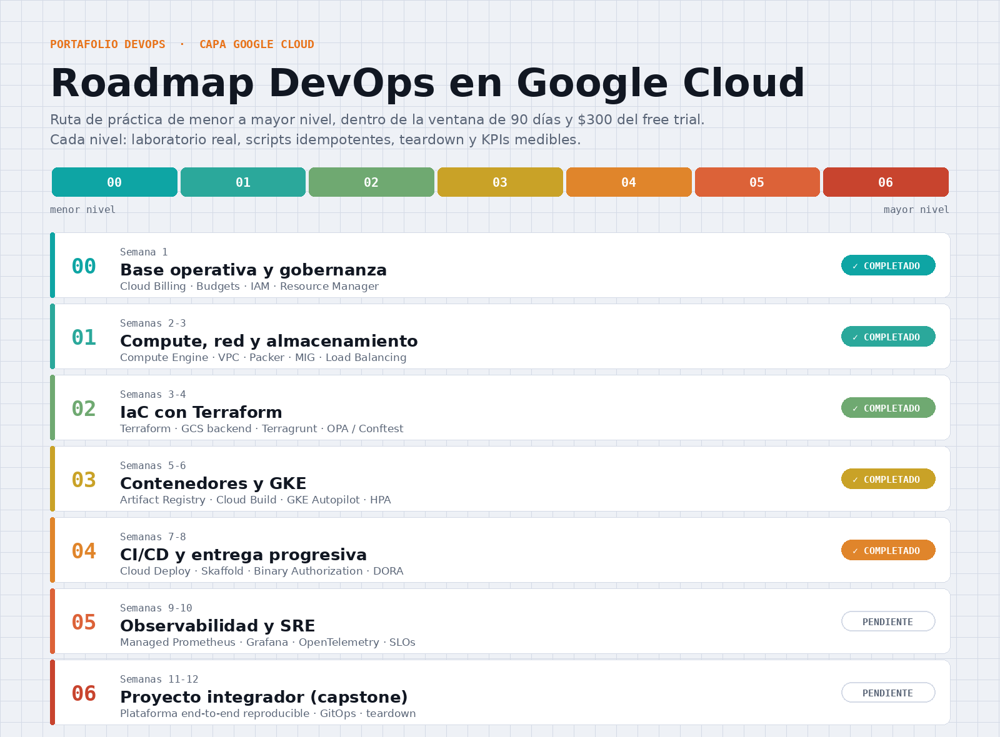

# GCP — Laboratorios DevOps en Google Cloud

Portafolio técnico de prácticas DevOps sobre Google Cloud Platform, construido como
una ruta progresiva de menor a mayor nivel dentro de la ventana de **90 días y $300**
del free trial.

Cada nivel resuelve un problema real de infraestructura, entrega **scripts idempotentes**,
incluye **teardown** antes de crear cualquier recurso con costo, y se valida con **KPIs medibles**.



---

## Estructura del repositorio

```
GCP/
└── Labs/
    ├── 00-BaseOperativa_&_Gobernanza/   # Billing, presupuestos, IAM, proyectos
    ├── 01-Compute_red/                  # VPC, Packer, MIG, Load Balancer, GCS
    └── 02-Terraform_IaC/                # Terraform, Terragrunt, OPA/Conftest
```

---

## Estado del roadmap

| Nivel | Tema | Estado |
|:-----:|------|:------:|
| **00** | Base operativa y gobernanza | ✅ Completado |
| **01** | Compute, red y almacenamiento | ✅ Completado |
| **02** | IaC con Terraform | ✅ Completado |
| **03** | Contenedores y GKE | ⏳ Pendiente |
| **04** | CI/CD y entrega progresiva | ⏳ Pendiente |
| **05** | Observabilidad y SRE | ⏳ Pendiente |
| **06** | Proyecto integrador (capstone) | ⏳ Pendiente |

---

## Nivel 00 · Base operativa y gobernanza

Blindaje de la cuenta antes de gastar un solo peso de crédito.

**Entregables**
- `bootstrap-nivel00.sh` — crea proyectos `dev`/`prod`, vincula facturación, habilita APIs
  base, crea service accounts **sin llaves JSON** (impersonación) y configura presupuesto
  con alertas al 25 / 50 / 90 / 100 % más una alerta por gasto previsto.

**Decisiones de diseño**
- Separación de entornos en proyectos distintos (`lab-dev` / `lab-prod`).
- Service accounts **keyless**: se usa `roles/iam.serviceAccountTokenCreator` + impersonación
  en lugar de descargar llaves.
- Roles **just-in-time**: la SA arranca con permisos mínimos y se amplían por nivel.
- Presupuesto configurado con `EXCLUDE_ALL_CREDITS` para medir **gasto bruto**, que es el
  indicador útil para vigilar la quema del crédito de prueba.

**KPIs**
- 0 cargos inesperados · presupuesto con alertas activas · proyectos reproducibles desde script.

---

## Nivel 01 · Compute, red y almacenamiento

Infraestructura clásica de una app web, construida a mano con `gcloud` para entender los
primitivos antes de automatizarlos.

**Entregables**
- `nivel01-red.sh` — VPC en modo *custom*, subred y firewall mínimo.
- `web-app.pkr.hcl` + `nivel01-imagen.sh` — *golden image* con Packer (builder `googlecompute`).
- `nivel01-mig.sh` — plantilla de instancias, MIG regional, autoescalado y autohealing.
- `nivel01-lb.sh` — Application Load Balancer externo (cadena de 5 componentes).
- `nivel01-storage.sh` — bucket de estáticos con acceso uniforme y versionado.
- `nivel01-teardown.sh` — apagado en orden inverso de dependencias.

**Decisiones de diseño**
- **SSH solo por IAP** (`35.235.240.0/20`): nunca se expone el puerto 22 a internet.
- VMs **sin IP pública**: el Load Balancer es la única entrada; las instancias solo aceptan
  tráfico de los rangos de health check de Google (`130.211.0.0/22`, `35.191.0.0/16`).
- **MIG regional** en lugar de zonal: tolerancia a fallos de zona sin costo adicional.
- Patrón *golden image*: la app se hornea en la imagen para que el autoescalado responda
  en segundos, no en minutos.

**KPIs**
- App accesible por el LB · escalado horizontal N→2N demostrado · imagen versionada por familia.

---

## Nivel 02 · IaC con Terraform

Toda la infraestructura del Nivel 01, reconstruida como código modular, multi-entorno y
con gobernanza automática.

**Entregables**
```
02-Terraform_IaC/
├── infra/                       # módulo raíz autocontenido
│   ├── apis.tf network.tf compute.tf edge.tf
│   └── modules/ { network · compute · storage · loadbalancer }
├── live/                        # entornos con Terragrunt
│   ├── root.hcl                 # backend + provider generados por entorno
│   ├── dev/  { env.hcl · platform/ }
│   └── prod/ { env.hcl · platform/ }
├── policy/                      # políticas OPA (Rego)
│   ├── firewall.rego            # prohíbe 0.0.0.0/0
│   ├── labels.rego              # exige labels de trazabilidad
│   └── machine_type.rego        # restringe tipos de máquina (costo)
└── .github/workflows/terraform-ci.yml
```

**Decisiones de diseño**
- **Estado remoto** en GCS con versionado y bloqueo automático.
- **Impersonación keyless**: el provider actúa como la `terraform-sa` usando las ADC del
  usuario. Verificado con un output que devuelve la identidad efectiva.
- La SA **no puede otorgarse permisos a sí misma**: los roles los concede un humano vía
  `gcloud`, evitando escalada de privilegios.
- **Plantillas inmutables** con `create_before_destroy` + `update_policy` declarada.
- **Terragrunt DRY**: los `terragrunt.hcl` de `dev` y `prod` son idénticos; toda la
  diferencia vive en un `env.hcl` de cuatro líneas.
- **Policy gate**: las políticas se evalúan contra el `plan` en JSON, no contra el HCL,
  de modo que se juzga lo que *va a pasar*.

**Flujo del policy gate**
```bash
terragrunt plan -out=tfplan.binary
terragrunt show -json tfplan.binary > tfplan.json
conftest test -p ../../../policy tfplan.json
```

**KPIs**
- Infra reproducible desde cero con un `apply` · drift = 0 · estado remoto con locking ·
  políticas cubriendo firewall, labels y tipo de máquina.

---

## Aprendizajes técnicos

Notas de cosas que costaron tiempo y vale la pena recordar:

- **Condición de carrera en la golden image.** Usar `hostname` dentro de una imagen horneada
  devuelve el nombre de la VM de build, porque el agente de GCE aún no lo ha reescrito.
  La fuente autoritativa es el servidor de metadata (`instance/name`), disponible desde el
  primer instante del arranque.
- **Rolling update en MIG regional.** `max_surge` y `max_unavailable` deben ser `0` o
  **≥ número de zonas** del grupo. Fijar la distribución a 2 zonas hace viable un
  `surge=2, unavailable=0` (cero downtime) sin instancias extra innecesarias.
- **Gasto bruto vs. neto.** Un presupuesto con `INCLUDE_ALL_CREDITS` mide el costo *después*
  del crédito, así que durante el trial se queda en cero y nunca alerta. Para vigilar la
  quema del crédito hay que excluir los créditos.
- **Quota project de las ADC.** `gcloud auth login` y `gcloud auth application-default login`
  son credenciales distintas. Terraform usa las segundas; desalinearlas produce advertencias
  de cuota difíciles de rastrear.
- **`gcloud beta projects move`** es necesario para mover proyectos bajo un nodo de
  organización en algunas versiones del SDK.
- **Las APIs se adoptan, no se reinstalan.** `google_project_service` sobre una API ya
  habilitada la incorpora al estado; con `disable_on_destroy = false` un `destroy` no la apaga.

---

## Disciplina de costo

El crédito y los 90 días corren en paralelo y se agotan con lo que ocurra primero.
Reglas aplicadas en todos los niveles:

1. El teardown se escribe **antes** de crear el primer recurso con costo.
2. Se prefieren máquinas económicas (`e2-micro`) y `min_replicas = 1` fuera de las demos.
3. Los recursos gratuitos (VPC, firewall, imágenes, bucket de estado) se conservan entre
   sesiones; solo se destruye lo que cobra.
4. Presupuesto con alertas por correo como red de seguridad — recordando que un presupuesto
   **notifica, no corta** el gasto.

---

## Requisitos

| Herramienta | Uso |
|---|---|
| `gcloud` CLI | Gobernanza, bootstrap y verificaciones |
| Terraform ≥ 1.6 | Infraestructura como código |
| Terragrunt | Multi-entorno DRY |
| Packer | Golden images para Compute Engine |
| Conftest / OPA | Policy as code sobre el plan |

---

## Licencia

Proyecto académico y de portafolio personal.
